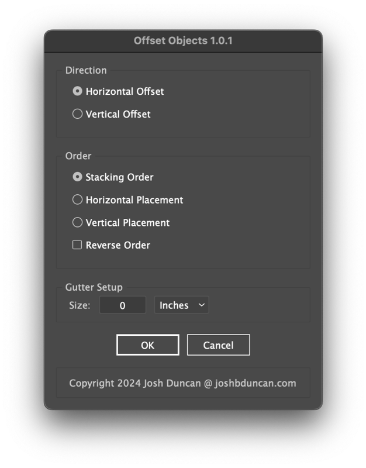
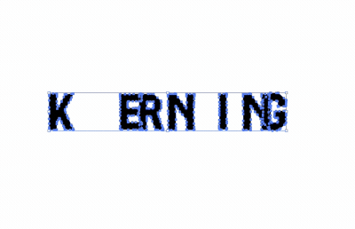

# Adobe Illustrator Scripts

JSX Scripts for Adobe Products

**Getting Started**

1. Download the [repository ZIP archive](https://github.com/joshbduncan/illustrator-scripts/archive/refs/heads/main.zip) to your computer.
2. Install script files from the `jsx` directory into your Presets folder ([learn how](https://www.marspremedia.com/software/how-to-adobe-cc)).
3. Restart Illustrator.

**Script Categories**

- [Alignment Scripts](#alignment-scripts)
- [Utility Scripts](#utility-scripts)

## Alignment Scripts

- [Offset Objects](#offsetobjects)

### OffsetObjects

[](/jsx/utils/OffsetObjects.jsxinc)

Offset selected objects vertically or horizontally by stacking order or artboard placement.





## Utility Scripts

- [GetObjectPlacementInfo](#getobjectplacementinfo)
- [GetVisibleBounds](#getvisiblebounds)
- [Logger](#logger)

### GetObjectPlacementInfo

[](/jsx/utils/GetObjectPlacementInfo.jsxinc)

Provide the bounds of a `PageItem` and get all of its placement information. Includes `left`, `top`, `right`, `bottom`, `width`, `height`, `centerX`, and `centerY`.

```javascript
var myObject = app.activeDocument.pageItems[0]
var myObjectPlacementInfo = getObjectPlacementInfo(myObject.visibleBounds)
```

### GetVisibleBounds

[](/jsx/utils/GetVisibleBounds.jsxinc)

Determine the actual "visible" bounds for an object accounting for clipping mask and compound paths.

```javascript
var clippedObject = app.activeDocument.pageItems[0]
var bounds = getVisibleBounds(clippedObject)
```

### Logger

[](/jsx/utils/Logger.jsxinc)

Module for easy file logging from within Adobe ExtendScript.

Features:
- timestamps
- "append" or "write" modes
- file size rotation
- optional forwarding of any writes to the console via `$.writeln()`
- multiple argument concatenation `logger.log("arg1", "arg2", "arg3")`

```javascript
var logFile = Folder.userData + "example.log";
logger = new Logger(logFilePath);
logger.log("hello, world!");
```